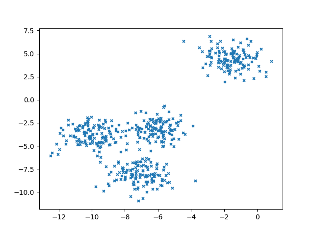
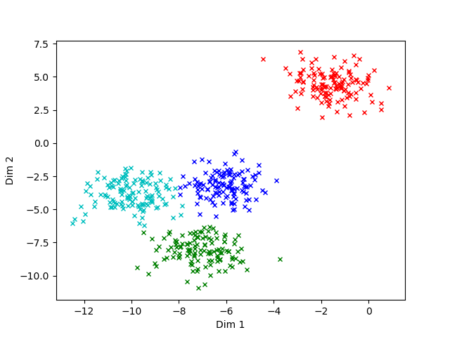
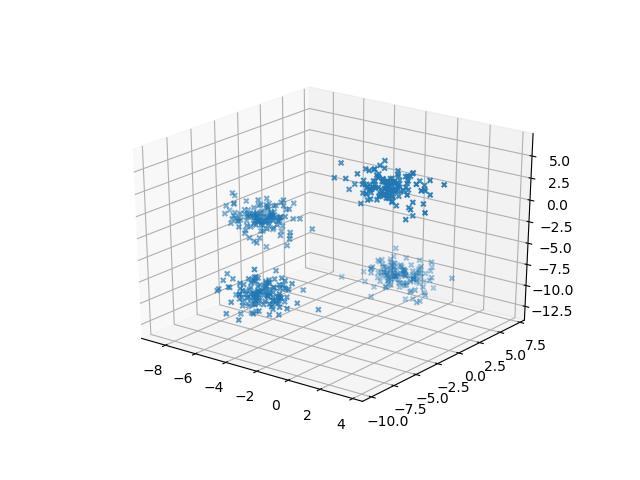
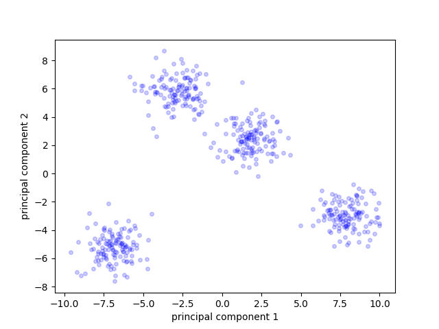

## Clustering: an Introduction

The purpose of clustering data is to identify unique differences that cannot be otherwise determined by looking at the data. The algorithms exploit different mathematical approaches to dfferentiate one data point form the other and conglomerate the points that has similar properties. It's an unsupervised learning method and is highly used in statistical data analysis. 

The most well known clustering method is the k-means clustering and we'll study here forth how to use the algorithm with our data

**K- Means Clustering**

The basic algorithms in step wise is as follows, 
  1. Determine the number of classes the data needs to be clsutered and randomly initialize the cluster centroid of each class within the data points. (Determining the number of clusters can be done by having a look in to the data with visualization techniques such as Prciple Component Analysis(PCA) or Selef Organizing Maps(Kohonen Networks) - we'll study those in upcoming lessons. Also it's valuable to remember that the algorithm is sensitive for the initial initialization of centroid points which we did randomly here)
  2. Each data point is assigned to the nearest neighbouring cluster centroid according to the distance from the centroid. 
  3. Based on assigned datapoints we compute the new centroid as the mean of the all vectors of the data points thus assigned. 
  4. Repeat the above steps for pre defined number of iterations or until the centroids don't change the poition much in the step 3. 
  
we'll implement K-means using several API and from scratch as well. To begin with we'll implement the k-means clustering offered by the scikit learn library. Firstly we'll generate our own dataset using scikit learn function and then move to a real world dataset. 

The dataset generated by the scikit learn _make blob_

The _make blob_ function outputs data points according to a isotropic gaussian distribution (find out isotropic gaussian meaning here : https://math.stackexchange.com/a/2137851)
```python
from sklearn.datasets import make_blobs
import matplotlib.pyplot as plt

X, y = make_blobs(n_samples=500,
                  n_features=2,
                  centers=4,
                  cluster_std=1,
                  center_box=(-10.0, 10.0),
                  shuffle=True,
                  random_state=1)

print(X) #outputs a dataset with 2 features and 500 samples
print(y) #outputs cluster labes for 500 samples

plt.scatter(X[:,0],X[:,1],marker = "x", s= 12)
plt.show()
```      
following is the graph generated above, 


You can see that the dataset contains 4 clusters. We can implement the kmeans clustering directly on this data and obtain the separation of clusters. In reality the real world problems mostly doesn't come with how many clusters that it contains, usually it's one of the questions that needs to be answered. Hence there are several ways we can use to know how many clusters the dataset may contain. 

The scikit lean kmeans algorithms can be implemented as follows, 
The algorithm tries to minimise a parameter known as inertia or within-cluster sum-of-squares. The algorithm clusters the data in groups with equal variance. (more about within-cluster sum-of-squares can be found here https://discuss.analyticsvidhya.com/t/what-is-within-cluster-sum-of-squares-by-cluster-in-k-means/2706/2). 

clustering with scikit learn, 

Assume that above code has already generated X for the following code.
```python
from sklearn.cluster import KMeans

kmeans = KMeans(n_clusters = 4)
kmeans.fit(X)

centroids = kmeans.cluster_centers_ #outputs the centroids
labels = kmeans.labels_ #outputs the labels for each sample in the order of given samples

colors = ["g","r","b","c","m","y","k","w"]

for i in range(len(sales_date)):
    print "Coordinate :", X[i], "Labels :", labels[i]
    plt.plot(X[0,i],X[1,i], colors[labels[i]], marker = "x", markersize = 10)
    
plt.xlabel("Dim 1")
plt.ylabel("Dim 2")
plt.show()

```
The following result is given by the above code,



There are few parameters in the above function that you can change and experiment with. Details about those can be found on documentation page: http://scikit-learn.org/stable/modules/generated/sklearn.cluster.KMeans.html#sklearn.cluster.KMeans

Let's examine the solutions available to the question of knowing how many clusters your data may contain before applying the kmeans, since kmeans requires you to enter number of clusters and gussing a number is mostly of luck than reasoning!

The mostly used way is visualization of your data before clustering algorithms run. The PCA or priciple component analysis is one of the way you can use to represent the data by dimention reduction to 2 or 3 dimensions, so you can represent it on a visual graph. The PCA inherently looses the details of the higher dimentional data hence it selects the dimentions based on highest variance. But because of the fact that it chooses dimentions with highest variance it can also reveal the clusters that your data contains by spreading them out more. 
You can run Kmeans computationally more inexpensively if you apply PCA before Kmeans. But because the data looses most of it's details during dimentionality reduction it's not a good practice unless there are humungous amount of features that makes the clustering itself computationally expensive enough to make it practically impossible. 

The PCA function can be found in sklearn library that can be used directly similar to kmeans used before. 

Let's create some higher dimentional data first. Here 3 dimentional. 

```python
from sklearn.datasets import make_blobs
import matplotlib.pyplot as plt
from mpl_toolkits.mplot3d import Axes3D

fig = plt.figure()
ax = fig.add_subplot(111, projection='3d')

X, y = make_blobs(n_samples=500,
                  n_features=3,
                  centers=4,
                  cluster_std=1,
                  center_box=(-10.0, 10.0),
                  shuffle=True,
                  random_state=1)

print(X) #outputs a dataset with 2 features and 500 samples
print(y) #outputs cluster labes for 500 samples

ax.scatter(X[:,0],X[:,1],X[:,2],marker = "x", s= 12)
plt.show()
``` 
Following is the result generated by above code, 


Let's take the PCA of the 3 dimentional data and reduce it to 2 dimentional data. 

```python
from sklearn.decomposition import PCA

pca = PCA(n_components = 2)
principalComponents = pca.fit_transform(features)

plt.figure()
for i in range(len(principalComponents)):
    plt.scatter(principalComponents[i][0],principalComponents[i][1], c = marker_l[i][1], marker = marker_l[i][0])

plt.xlabel("principal component 1")
plt.ylabel("principal component 2")
plt.show()
```
The result of the above code is depicted below, 


The result clearly shows that the PCA enables to visualize the dataset showing the possible nunmber of clusters. This will not always be clear as above, but the potential of the method remains valuable for cluster analysis.

Let's study the method of self organizing maps method of visualizing the dataset. It's also another valuable visualization technique to get an idea of how many clusters available in the dataset. Basically what it does is representing higher dimentional data in a lower diementional map. It also groups the items with similar characteristics and hence is a clustering technique. What's most important is, it does all these preserving the topological nature of the dataset unlike PCA it preserve the original data set topology. 

Let's discuss how the algorithm works on a seperate page reserved for Kohonen maps. For now let's learn how to use it to help gain knowledge about the dataset that we deal with. 

We'll be using a library known as SOMPY created by Vahid Moosavi. 

The github repository for SOMPY library : https://github.com/sevamoo/SOMPY. Download the whole file and install it using the setup.py file. 


